# Coursework for CS-499 at Southern New Hampshire University
This portfolio will include all coursework in CS-499, which aims to demonstrate competency in keys areas of Computer Science as a Capstone Project for the Bachelor's Degree program.

[Here is my personal repository for the project](https://github.com/FlowerBoy-SkullGirl/gl_engine)

### Table of Contents
[Video Code Review](#video-code-review)

[gl\_engine](#gl_engine)

[Software Design and Engineering Enhancements](#software-design-and-engineering-enhancements)

[Software Design Enhancement 1: Documentation](#enhancement-1-documentation)

[Software Design Enhancement 2: Feature Addition](#enhancement-2-feature-addition)

[Software Design Enhancement 3: Testing](#enhancement-3-testing)

[Algorithms and Data Structures](#algorithms-and-data-structures)

[Algorithms Enhancement 1: System Call Efficiency](#enhancement-1-system-call-efficiency)

### Video Code Review
As part of the coursework in CS-499, we conducted a code review which assesses the original state of the project, highlights the areas that need improvement, and outline the planned enhancements. The video can be accessed [here.](https://youtu.be/dlVn9z3ZkN4)

### gl\_engine
In CS-499, we were tasked with creating enhancements in three categories for any number of one to three different projects. Performing these enhancements, we would demonstrate competency in the course outcomes. For each category, I have chosen to work on a personal project that I have worked on over the course of my time as a computer science student called gl\_engine, which is a simple 2D game engine written in C and C++ and utilizing the OpenGL graphics library. 

The reasons I chose this project as the one I would enhance as a capstone to my computer science degree are numerous. First, I was confident that each enhancement category could be fulfilled and integrated into this project, showcasing my ability to write modular and adaptable code that is open to modification without breaking. In addition, the project is one of the largest I have built, demonstrating an ability to work with multiple pieces at scale and architect systems that are meant to fulfill many features cleanly. The project also overlaps with many of my personal interests and potential career paths: graphics programming being the most obvious, but also programming in C and C++ and working at lower levels of abstraction in the technology stack (implementing most of my own libraries for the project and having very few dependencies). Lastly, it is one of my highest quality works, and I believe it is the best artifact to advocate for my competency in the desired course outcomes.

# Software Design and Engineering Enhancements
### Enhancement 1: Documentation

For the ‘Software Design and Engineering’ enhancement category, I took a look at what enhancements could make a project successful in a collaborative environment rather than just what code could be written to ensure my personal project compiles and runs. Where I am able to work on my own project with few notes about what a particular function does or how to call it, a collaborative team environment requires far more purposeful documentation. That is why my first enhancement was to create a collection of html pages that document the structure of the project, the relationship between different libraries and objects, and some finer details of the more important libraries, their functions, and how data is accessed and structured by them. The html pages contain hyperlinks which were created to make exploration of the documentation easy, regardless of platform, and diagrams to add clarity to code relationships.

In addition to the html pages, the comments were improved in every source code file in the project to specify function arguments, return values, memory allocation, and which functions must be called to deallocate memory. 

Throughout the codebase, ‘magic numbers’ were identified and replaced with constants or preprocessor directive definitions to clarify their purpose.

I believe that these enhancements exemplify several course outcomes, which I will quote verbatime here:

“1. Employ strategies for building collaborative environments that enable diverse audiences to support organizational decision making in the field of computer science 

2. Design, develop, and deliver professional-quality oral, written, and visual communications that are coherent, technically sound, and appropriately adapted to specific audiences and contexts”

I believe that through the development of well-crafted written and visual communications that relay different levels of technical information, making these communications available in a format that is readily available to any person with access to a web browser (which should encompass the wide majority of people who have access to a computer), and targeting these communications towards people who could contribute to the project with the intent of making the code more accessible to use and understand, that I have also demonstrated success in following through with my strategy to build a collaborative environment for the project, rather than an environment that I alone work in.

### Enhancement 2: Feature Addition
The above enhancement was one of three enhancements that I chose for this category, as the class rubric requires the total of all enhancements to be rather large in scope. The second enhancement was intended to add complexity to the project by increasing its scope through an additional feature, making design decisions that would allow for further improvements to take place in the future, and demonstrate the flexibility of the existing code to accommodate changes. For this purpose, I decided to add the feature of camera movement (or, more technically, translating screen space in the graphics pipeline). To do so, I created an enum to specify an acceptable set of implemented movement types, a struct ‘object’ to hold values for different camera properties, and a number of functions to determine how these values will be set and utilized.

This allows for the possibility of easily implemented future camera movement types without breaking current functionality through the addition of new enumerator values and the flexible implementation of the ‘move_camera()’ function, which can offload the implementation of different movement types to their own respective functions, while remaining simple in its own implementation.

While building the system, the previously global scope values for camera properties were becoming more numerous and difficult to handle. It is still advantageous for any section of the project code to have immediate access to the camera properties without being passed the camera struct through function calls (which may require multiple nested calls, and passing the argument multiple times), for example in a scenario where we may wish to reduce the calculation of physics to only those objects which are relatively near to the camera position. The solution to this problem was to make the camera struct object global in scope and ensure that each of these important properties were contained within it. In this way, we only need to be aware of one global scope name, but still have access to the desired variables.

The course outcomes that this enhancement demonstrates are as follows:

“3. Design and evaluate computing solutions that solve a given problem using algorithmic principles and computer science practices and standards appropriate to its solution, while managing the trade-offs involved in design choices (data structures and algorithms) 

4. Demonstrate an ability to use well-founded and innovative techniques, skills, and tools in computing practices for the purpose of implementing computer solutions that deliver value and accomplish industry-specific goals (software engineering/design/database)”

My design choices used in the additional feature clearly demonstrate my ability to evaluate solutions for a given problem and find advantages to certain architectural decisions that will enable the project to succeed with further enhancements in the future. My use of various C language features that best solve the project’s given problem also shows an ability to use industry standard techniques, skills, and tools to deliver value to a project or specific goal.

### Enhancement 3: Testing
Prior to beginning this enhancement, the project had very little in the way of formal testing. Some debugging print statements were present, as well as some visual debugging utilizing the OpenGL shaders, but there was no formal difference between debugging and production builds. For my final enhancement in the Software Design category, I decided to create a testing suite for the project that also evaluated the memory safety of the project and additionally creating a debugging flag that could be used to toggle debugging information on or off in the running process. This would align my project with a larger scale, more ‘enterprise’ project that is ready for release after undergoing quality assurance. It was also important to me that I make the testing automated in some way so that it could be utilized in a ‘group work’ setting, where tests must be reproducible and easy to run.

The addition of the debugging flag was simple, as only one integer variable was added to global scope called ‘g\_debugging,’ and an additional shader uniform was created with the name ‘debugging\_enabled.’ Around every debugging statement later in the program, a conditional statement was added like so:
    if (g\_debugging){
	    perform\_debugging\_feature();
    }
The testing suite was the more substantial improvement. A new directory called ‘test’ was created, where log files and test ‘driver’ programs would be stored. One sample test was created, which calls all of the ‘constructor’ and ‘destructor’ functions on the various objects inside the project that must be built before objects can be rendered on screen. At first, my intention was to create assertions within this code to ensure that the memory was being handled correctly, but this turned out to not be feasible with available tools. Luckily, the industry-standard tool ‘valgrind,’ traces memory errors to the functions where the memory was allocated, and by using regular expressions to search the log file it creates, we are able to verify that no memory errors it detects originated from our constructor functions. To automate this workflow, some new build lines were added to the existing GNU Makefile, meaning that one only has to run the commands ‘make test\_suite’ and ‘make run\_tests’ to compile and run the testing suite. From there, valgrind is run on the process to detect any memory errors and create a log file, and grep is used to search the log file for the names of the functions we called. The results of the search are printed using bash commands.

This enhancement exemplifies the goals several key course outcomes:

“1. Employ strategies for building collaborative environments that enable diverse audiences to support organizational decision making in the field of computer science

4. Demonstrate an ability to use well-founded and innovative techniques, skills, and tools in computing practices for the purpose of implementing computer solutions that deliver value and accomplish industry-specific goals (software engineering/design/database)

5. Develop a security mindset that anticipates adversarial exploits in software architecture and designs to expose potential vulnerabilities, mitigate design flaws, and ensure privacy and enhanced security of data and resources”

The creation of automation that is reproducible and easily utilized by a full time promotes the creation of a collaborative environment. The use of industry-standard tools like valgrind, GNU make, and testing driver programs to achieve industry-specific goals like quality assurance testing showcase outcome 4. The act of testing to reduce errors, prevent the inclusion of errors, and ensure the memory-safety of the program, which is the most exploited attack surface of any C program, demonstrates the use of a security mindset and architecting security as a first class priority into the project.

Altogether, I believe this collection of enhancements not only demonstrates my competency in key areas of my degree program, but also shows that I am able to build real projects, with real quality assurance, that deliver on scalability and performance. I believe I have also demonstrated this in a way that shows that I have the capability to integrate individual work into a team environment that can be built upon by any team member, regardless of familiarity with the original code.

# Algorithms and Data Structures

### Enhancement 1: System Call Efficiency
In the category of Algorithms and Data Structures, I implemented three enhancements that targeted the efficiency, complexity, and robustness of the project. The first enhancement was a modification to the existing code in the project, intending to improve the efficiency of the code in the main rendering loop by eliminating repetitive system calls. Originally, a memory allocation call was made each time the program attempted to calculate if one object’s hitbox had a vertex within the coordinates of another. For each pair of objects, the worst case for performance is running n^2 times, where n is the number of hitboxes, due to the nested for loops used to iterate the hitbox lists. Due to this drawback, the number of times the calculations are performed are limited by first checking how far apart two objects are by finding a vector between the two and skipping any pairs that are farther apart than their widest dimension.
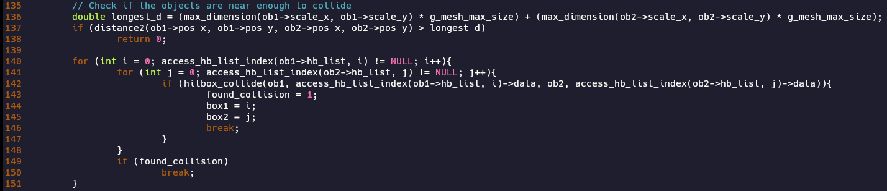

Memory has to be allocated for the transformations to be performed so that the original vertex arrays are preserved. Because a hitbox may have any number of vertices, the memory must be allocated dynamically during runtime, or else some predefined limit must be created so that an appropriately sized array could be declared at compile time. Since the function can run potentially many times during each frame the program wishes to draw, reducing the number of system calls used to allocate memory within the function was a high priority. The solution I engineered closely resembles a ‘singleton’ pattern. Instead of allocating and freeing memory each time the function is called, the new algorithm will check what size of memory has already been allocated. If the size is sufficient to hold the vertices of both objects, no allocation is made. If the objects have more vertices than can currently be stored, the memory size is reallocated to store twice the largest number of vertices between the two objects. 
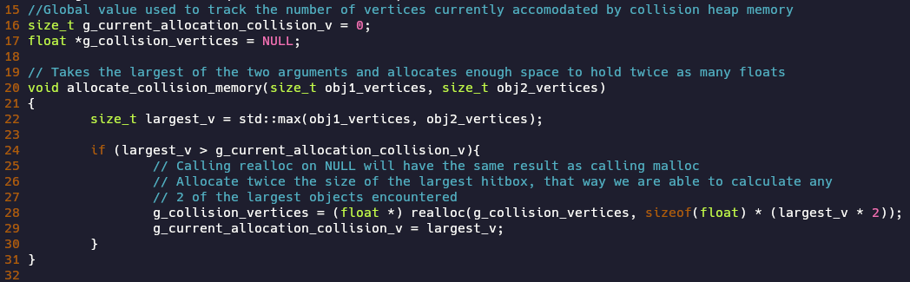
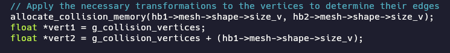

This way, system calls are only made when necessary to store a larger amount of memory, and in most cases, where the same objects are being compared frame after frame, new allocations will have to be made far less frequently than before. The drawback of this method is that any program that calls a collision library function now must call the free\_collision\_memory() function during cleanup.

In the sample program, only two objects are ever checked for collision, so the number of vertices never increases, and only one system call is ever made, whereas before, there were 2 system calls (malloc and free) for each hitbox, for each frame. With n(the number of hitboxes) being so small, this change does not significantly impact the time to draw each frame, however, with larger values for n, the impact would expectedly be much greater.
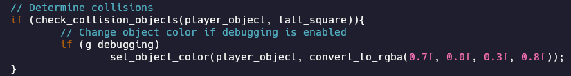

Below is pictured a before and after for real time between each frame, showing that, at low values for n, the real time difference was not measureable, despite the measurable reduction of system calls. 
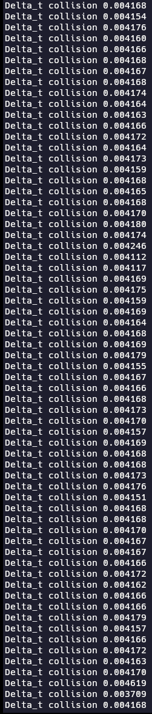 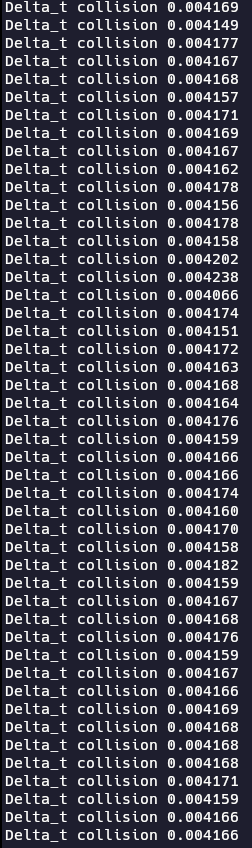
	
The course outcomes I wished to demonstrate with this change were as follows:

“3. Design and evaluate computing solutions that solve a given problem using algorithmic principles and computer science practices and standards appropriate to its solution, while managing the trade-offs involved in design choices (data structures and algorithms) 

4. Demonstrate an ability to use well-founded and innovative techniques, skills, and tools in computing practices for the purpose of implementing computer solutions that deliver value and accomplish industry-specific goals (software engineering/design/database) 

5. Develop a security mindset that anticipates adversarial exploits in software architecture and designs to expose potential vulnerabilities, mitigate design flaws, and ensure privacy and enhanced security of data and resources”

By using a singleton-like pattern to implement a solution that improved the system call efficiency of the program, I demonstrated the ability to use well-founded techniques to deliver on industry-specific goals (4). Evaluating the existing inefficiency in the program and designing an algorithm that would eliminate that deficiency with minimal drawbacks shows my ability to appropriately apply algorithms to a given problem (3). Finally, minimizing the number of calls to malloc, the number of pointers being used, and centralizing how that memory is allocated, accessed, and freed contributes to safer code that is less likely to perform memory errors, reduces the difficulty of tracing memory calls and evaluating memory safety, and makes it easier for future code in the project to make safe memory calls (5).

I was fairly surprised by how simple and effective it was to implement this change, but also dismayed by how little it changed the measureable time between frame draws. I am, however, satisfied by the great reduction in overall system calls.

### Enhancement 2: Transformation Algorithms
The second enhancement chosen for Algorithms and Data Structures was the implementation of acceleration in object movement and the creation of an algorithm which would accelerate a ‘tethered’ camera in the direction of a focused object when it is further than some distance away, but allow it to move freely (decelerate ‘naturally’) when it is within that distance. Previously, the vector library created for the project already contained some of the necessary algorithms to implement these features, but they were unused as of beginning this enhancement. 
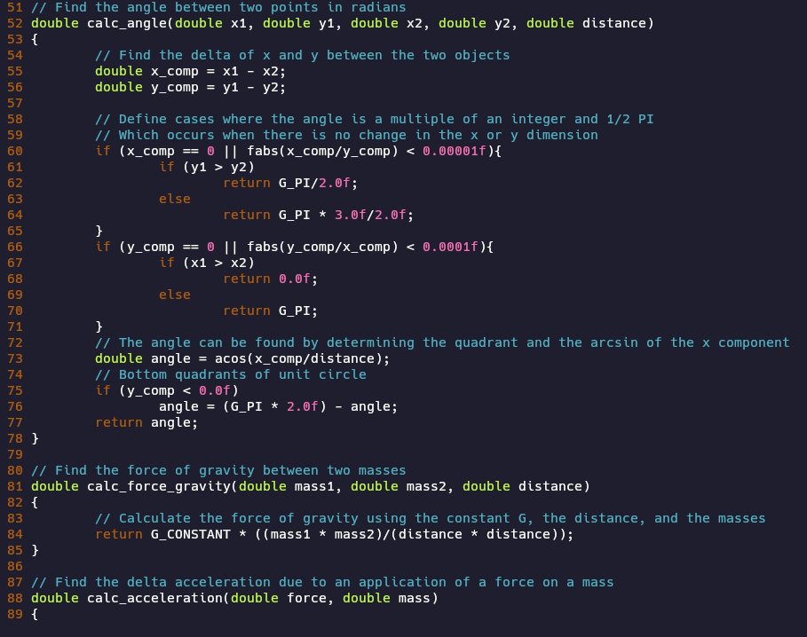

The implementation of object acceleration was done rather simply, by replacing the fixed velocities that were previously given with a new equation that multiplied the rate of acceleration by the change in time since the last frame, added it to current velocity, and gave it a ceiling of the declared maximum velocity.
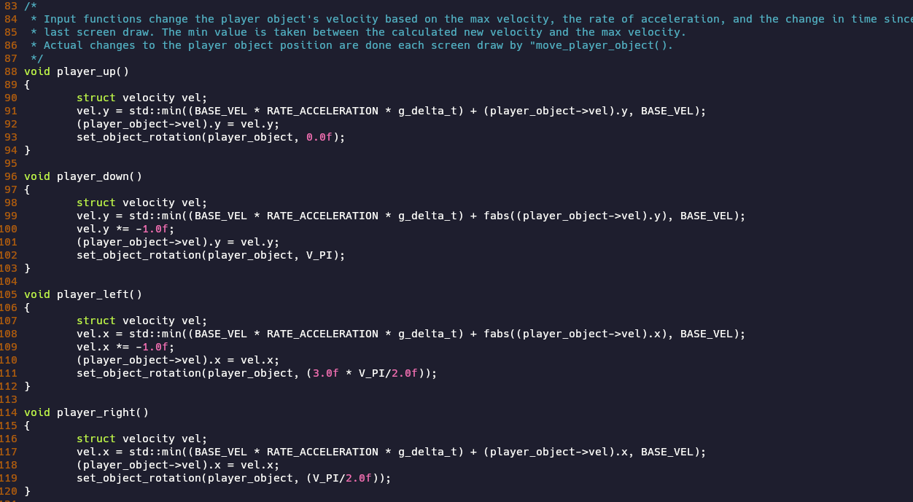

	
The more difficult work was implementing the ‘calculate\_tether()’ function, which was previously given a basic temporary implementation as part of the Software Engineering enhancements. This function checks if the camera is at a greater distance from the object than the desired ‘tether’ length, finds the angle between the camera and the object, finds the component magnitudes of the distance in the x and y dimensions, and changes the camera coordinates appropriately to be at exactly the distance of the tether at the same angle. It then changes the velocity of the camera to match that of the focus object so that the camera will begin to move in that same direction. If the camera is not further than the tether distance, it will begin to slow down by having a rate of acceleration 1/x, where x is some chosen value greater than 1.
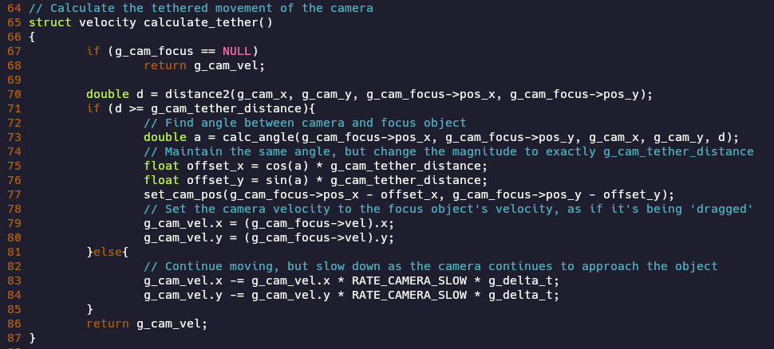

Since this enhancement was purely focused on algorithmic complexity and the addition of a new feature to the project, it targets only one course outcome:

“3. Design and evaluate computing solutions that solve a given problem using algorithmic principles and computer science practices and standards appropriate to its solution, while managing the trade-offs involved in design choices (data structures and algorithms)”

By using a mathematical and algorithmic solution to solve the problem of adding a new feature based on changing project requirements, I believe the enhancement strongly demonstrates this skill.

### Enhancement 3: Data Structure
The final enhacement of the Algorithms and Data Structures category was the implementation of a data structure that could flexibly hold serialized data of different types. This idea was integrated into the project by creating functions that would serialize and deserialize a game\_object struct (used in the project’s objects library), and will further be used in support of the Databases category of enhancements. The need for a data structure that could hold various structs, objects, and other data in a way that accomodates multiple data types and a variable number of elements became apparent while planning the database system that is to be implemented in the Databases enhancement. This ‘intermediary’ container allows for a common object that can be passed to and returned from the database functions, leaving the process of handling the data inside up to the program using the database API.

From these requirements, we know that four things are required: a heap of memory to store the data, a count of the elements being stored, an array of enumerators indicating the data types of each element, and the size of the memory heap. The size of the memory heap can be inferred by iterating the data type array and summing the sizes needed to store each element. The size of the data type array is known because it holds only one data type and stores the same number of elements as the memory heap.
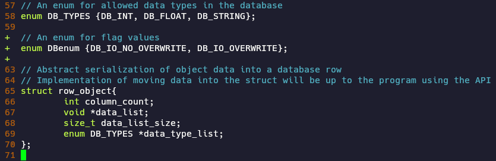

Memory allocation functions in C do not return pointers of specific data types; they are flexible in that they return a void \*, which may be cast to any data type. Due to this convention, we also store the pointer to the memory area as a void \*. It is, however, difficult to work with a void \*, as pointer arithmetic is not allowed, therefore the pointer is cast as a char \* whenever pointer manipulation is necessary, because char is guaranteed to be the minimum sized data type (typically an 8-bit byte on modern systems). In the chosen target environment (x86\_64 linux), the char \* will always address 1 byte, so processing the data byte by byte is much easier.
The images below shows the capability of using pointer arithmetic on the memory buffer when it is cast as a char \*.
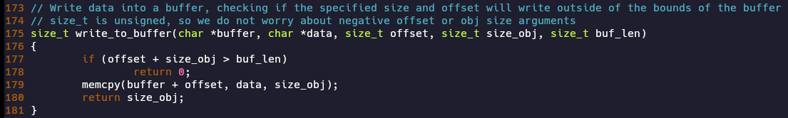
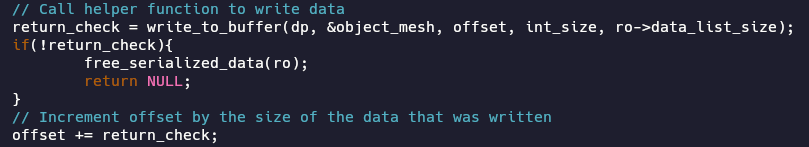

The images above also show a portion of the code used to serialize the game objects into the data structure. It is done by calling a wrapper function to memcpy, which copies the bytes of the passed data type into the data structure’s memory heap at the appropriate offset. The data can be deserialized by using the same offsets (which can be determined by the size of the data types listed by the data type array) and using memcpy with the object attributes as the destination and the data buffer as the source, rather than the other way around.
	
The course outcomes exemplified in this enhancement are:

“3. Design and evaluate computing solutions that solve a given problem using algorithmic principles and computer science practices and standards appropriate to its solution, while managing the trade-offs involved in design choices (data structures and algorithms) 

4. Demonstrate an ability to use well-founded and innovative techniques, skills, and tools in computing practices for the purpose of implementing computer solutions that deliver value and accomplish industry-specific goals (software engineering/design/database)”

By solving the problem of needing to accept a variable number of elements of multiple data types in a single argument by storing them in a data structure, then writing the appropriate algorithms to place data in and read data from this structure, I have shown the capacity to design and evaluate algorithmic solutions to a given problem (3). By appropriately utilizing the tools available in various C libraries that offer functions for memory manipulation and combining them with innovative techniques to deliver value to the project, I have demonstrated course outcome 4.
	
In combination with the goals reached in the previous Milestones, I believe that I have strong supporting evidence of my competencies in the course outcomes through these enhancements.
