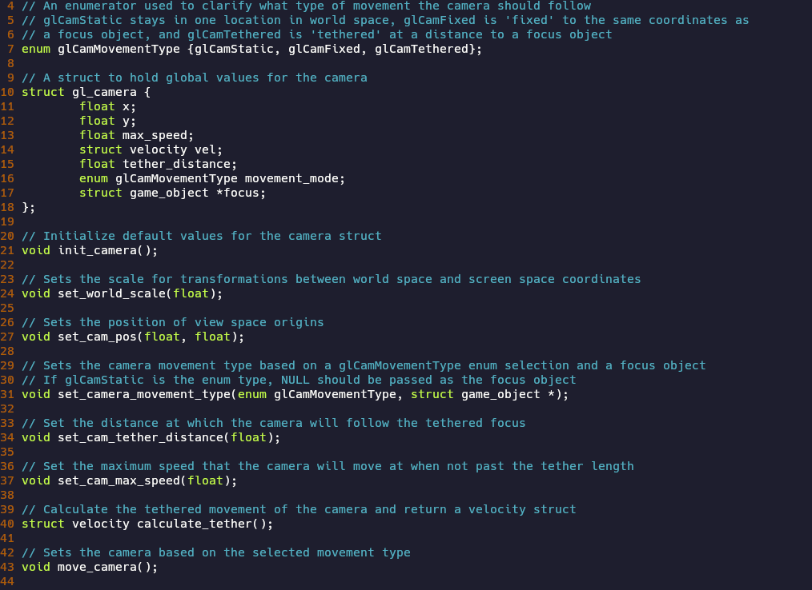
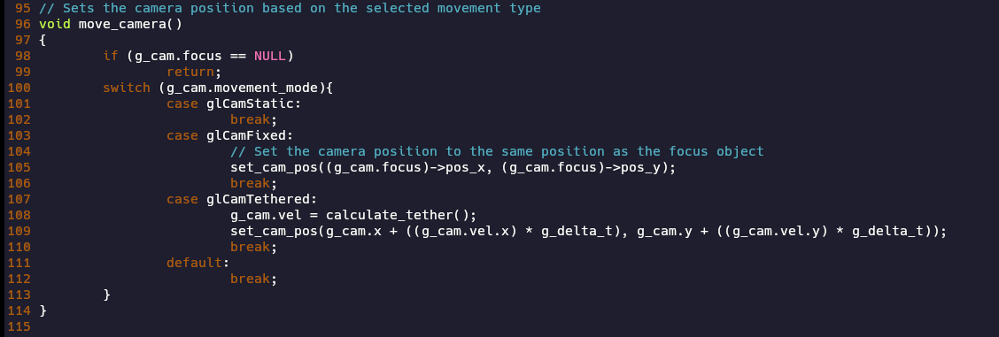
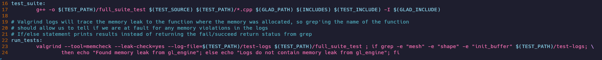
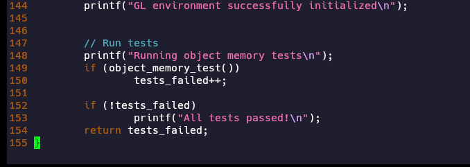

# Coursework for CS-499 at Southern New Hampshire University
This portfolio will include all coursework in CS-499, which aims to demonstrate competency in keys areas of Computer Science as a Capstone Project for the Bachelor's Degree program.

[Here is my personal repository for the project](https://github.com/FlowerBoy-SkullGirl/gl_engine)

### Table of Contents
[Video Code Review](#video-code-review)

[gl_engine](#gl_engine)

[Software Design and Engineering Enhancements](#software-design-and-engineering-enhancements)

[Enhancement 1: Documentation](#enhancement-1-documentation)

[Enhancement 2: Feature Addition](#enhancement-2-feature-addition)

[Enhancement 3: Testing](#enhancement-3-testing)

### Video Code Review
As part of the coursework in CS-499, we conducted a code review which assesses the original state of the project, highlights the areas that need improvement, and outline the planned enhancements. The video can be accessed [here.](https://youtu.be/dlVn9z3ZkN4)

### gl_engine
In CS-499, we were tasked with creating enhancements in three categories for any number of one to three different projects. Performing these enhancements, we would demonstrate competency in the course outcomes. For each category, I have chosen to work on a personal project that I have worked on over the course of my time as a computer science student called gl_engine, which is a simple 2D game engine written in C and C++ and utilizing the OpenGL graphics library. 

The reasons I chose this project as the one I would enhance as a capstone to my computer science degree are numerous. First, I was confident that each enhancement category could be fulfilled and integrated into this project, showcasing my ability to write modular and adaptable code that is open to modification without breaking. In addition, the project is one of the largest I have built, demonstrating an ability to work with multiple pieces at scale and architect systems that are meant to fulfill many features cleanly. The project also overlaps with many of my personal interests and potential career paths: graphics programming being the most obvious, but also programming in C and C++ and working at lower levels of abstraction in the technology stack (implementing most of my own libraries for the project and having very few dependencies). Lastly, it is one of my highest quality works, and I believe it is the best artifact to advocate for my competency in the desired course outcomes.

# Software Design and Engineering Enhancements
### Enhancement 1: Documentation

For the ‘Software Design and Engineering’ enhancement category, I took a look at what enhancements could make a project successful in a collaborative environment rather than just what code could be written to ensure my personal project compiles and runs. Where I am able to work on my own project with few notes about what a particular function does or how to call it, a collaborative team environment requires far more purposeful documentation. That is why my first enhancement was to create a collection of html pages that document the structure of the project, the relationship between different libraries and objects, and some finer details of the more important libraries, their functions, and how data is accessed and structured by them. The html pages contain hyperlinks which were created to make exploration of the documentation easy, regardless of platform, and diagrams to add clarity to code relationships.

In addition to the html pages, the comments were improved in every source code file in the project to specify function arguments, return values, memory allocation, and which functions must be called to deallocate memory. 

Throughout the codebase, ‘magic numbers’ were identified and replaced with constants or preprocessor directive definitions to clarify their purpose.

I believe that these enhancements exemplify several course outcomes, which I will quote verbatime here:
“1. Employ strategies for building collaborative environments that enable diverse audiences to support organizational decision making in the field of computer science 
2. Design, develop, and deliver professional-quality oral, written, and visual communications that are coherent, technically sound, and appropriately adapted to specific audiences and contexts”
I believe that through the development of well-crafted written and visual communications that relay different levels of technical information, making these communications available in a format that is readily available to any person with access to a web browser (which should encompass the wide majority of people who have access to a computer), and targeting these communications towards people who could contribute to the project with the intent of making the code more accessible to use and understand, that I have also demonstrated success in following through with my strategy to build a collaborative environment for the project, rather than an environment that I alone work in.

### Enhancement 2: Feature Addition
The above enhancement was one of three enhancements that I chose for this category, as the class rubric requires the total of all enhancements to be rather large in scope. The second enhancement was intended to add complexity to the project by increasing its scope through an additional feature, making design decisions that would allow for further improvements to take place in the future, and demonstrate the flexibility of the existing code to accommodate changes. For this purpose, I decided to add the feature of camera movement (or, more technically, translating screen space in the graphics pipeline). To do so, I created an enum to specify an acceptable set of implemented movement types, a struct ‘object’ to hold values for different camera properties, and a number of functions to determine how these values will be set and utilized.

This allows for the possibility of easily implemented future camera movement types without breaking current functionality through the addition of new enumerator values and the flexible implementation of the ‘move_camera()’ function, which can offload the implementation of different movement types to their own respective functions, while remaining simple in its own implementation.

While building the system, the previously global scope values for camera properties were becoming more numerous and difficult to handle. It is still advantageous for any section of the project code to have immediate access to the camera properties without being passed the camera struct through function calls (which may require multiple nested calls, and passing the argument multiple times), for example in a scenario where we may wish to reduce the calculation of physics to only those objects which are relatively near to the camera position. The solution to this problem was to make the camera struct object global in scope and ensure that each of these important properties were contained within it. In this way, we only need to be aware of one global scope name, but still have access to the desired variables.

The course outcomes that this enhancement demonstrates are as follows:
“3. Design and evaluate computing solutions that solve a given problem using algorithmic principles and computer science practices and standards appropriate to its solution, while managing the trade-offs involved in design choices (data structures and algorithms) 
4. Demonstrate an ability to use well-founded and innovative techniques, skills, and tools in computing practices for the purpose of implementing computer solutions that deliver value and accomplish industry-specific goals (software engineering/design/database)”

My design choices used in the additional feature clearly demonstrate my ability to evaluate solutions for a given problem and find advantages to certain architectural decisions that will enable the project to succeed with further enhancements in the future. My use of various C language features that best solve the project’s given problem also shows an ability to use industry standard techniques, skills, and tools to deliver value to a project or specific goal.

### Enhancement 3: Testing
Prior to beginning this enhancement, the project had very little in the way of formal testing. Some debugging print statements were present, as well as some visual debugging utilizing the OpenGL shaders, but there was no formal difference between debugging and production builds. For my final enhancement in the Software Design category, I decided to create a testing suite for the project that also evaluated the memory safety of the project and additionally creating a debugging flag that could be used to toggle debugging information on or off in the running process. This would align my project with a larger scale, more ‘enterprise’ project that is ready for release after undergoing quality assurance. It was also important to me that I make the testing automated in some way so that it could be utilized in a ‘group work’ setting, where tests must be reproducible and easy to run.

The addition of the debugging flag was simple, as only one integer variable was added to global scope called ‘g_debugging,’ and an additional shader uniform was created with the name ‘debugging_enabled.’ Around every debugging statement later in the program, a conditional statement was added like so:
    if (g_debugging){
	    perform_debugging_feature();
    }
The testing suite was the more substantial improvement. A new directory called ‘test’ was created, where log files and test ‘driver’ programs would be stored. One sample test was created, which calls all of the ‘constructor’ and ‘destructor’ functions on the various objects inside the project that must be built before objects can be rendered on screen. At first, my intention was to create assertions within this code to ensure that the memory was being handled correctly, but this turned out to not be feasible with available tools. Luckily, the industry-standard tool ‘valgrind,’ traces memory errors to the functions where the memory was allocated, and by using regular expressions to search the log file it creates, we are able to verify that no memory errors it detects originated from our constructor functions. To automate this workflow, some new build lines were added to the existing GNU Makefile, meaning that one only has to run the commands ‘make test_suite’ and ‘make run_tests’ to compile and run the testing suite. From there, valgrind is run on the process to detect any memory errors and create a log file, and grep is used to search the log file for the names of the functions we called. The results of the search are printed using bash commands.

This enhancement exemplifies the goals several key course outcomes:
“1. Employ strategies for building collaborative environments that enable diverse audiences to support organizational decision making in the field of computer science
4. Demonstrate an ability to use well-founded and innovative techniques, skills, and tools in computing practices for the purpose of implementing computer solutions that deliver value and accomplish industry-specific goals (software engineering/design/database)
5. Develop a security mindset that anticipates adversarial exploits in software architecture and designs to expose potential vulnerabilities, mitigate design flaws, and ensure privacy and enhanced security of data and resources”

The creation of automation that is reproducible and easily utilized by a full time promotes the creation of a collaborative environment. The use of industry-standard tools like valgrind, GNU make, and testing driver programs to achieve industry-specific goals like quality assurance testing showcase outcome 4. The act of testing to reduce errors, prevent the inclusion of errors, and ensure the memory-safety of the program, which is the most exploited attack surface of any C program, demonstrates the use of a security mindset and architecting security as a first class priority into the project.

Altogether, I believe this collection of enhancements not only demonstrates my competency in key areas of my degree program, but also shows that I am able to build real projects, with real quality assurance, that deliver on scalability and performance. I believe I have also demonstrated this in a way that shows that I have the capability to integrate individual work into a team environment that can be built upon by any team member, regardless of familiarity with the original code.
