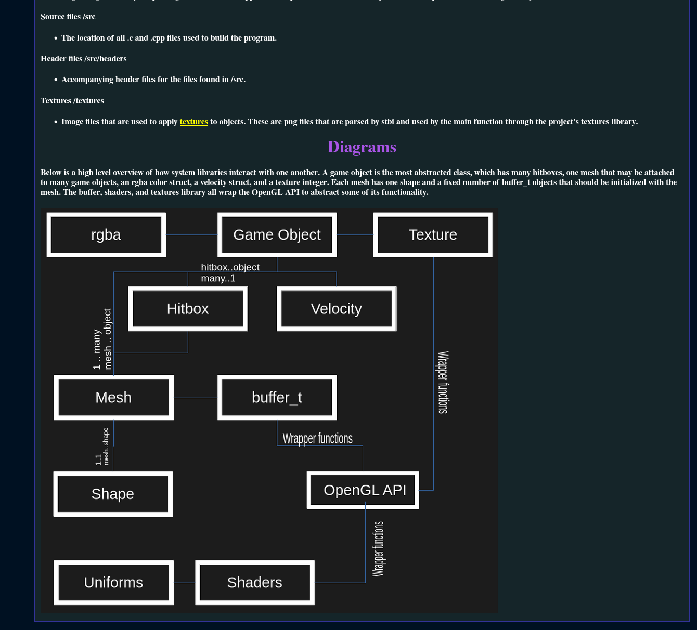
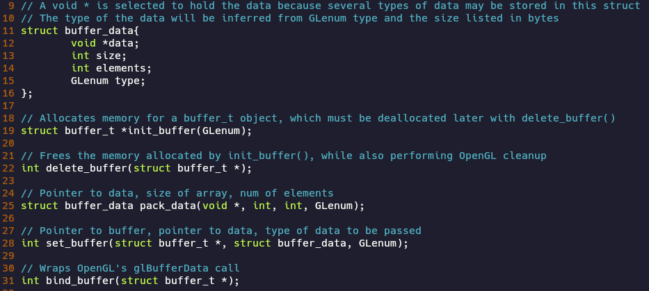
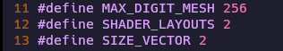
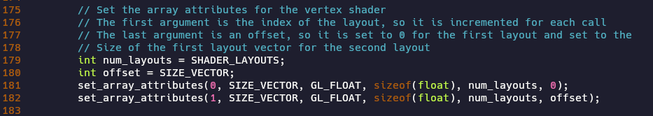

# Coursework for CS-499 at Southern New Hampshire University
This portfolio will include all coursework in CS-499, which aims to demonstrate competency in keys areas of Computer Science as a Capstone Project for the Bachelor's Degree program.

[Here is my personal repository for the project](https://github.com/FlowerBoy-SkullGirl/gl_engine)

### Table of Contents
[Video Code Review](#video-code-review)

[gl_engine](#gl_engine)

[Software Design and Engineering Enhancements](#software-design-and-engineering-enhancements)

[Enhancement 1: Documentation](#enhancement-1-documentation)

### Video Code Review
As part of the coursework in CS-499, we conducted a code review which assesses the original state of the project, highlights the areas that need improvement, and outline the planned enhancements. The video can be accessed [here.](https://youtu.be/dlVn9z3ZkN4)

### gl_engine
In CS-499, we were tasked with creating enhancements in three categories for any number of one to three different projects. Performing these enhancements, we would demonstrate competency in the course outcomes. For each category, I have chosen to work on a personal project that I have worked on over the course of my time as a computer science student called gl_engine, which is a simple 2D game engine written in C and C++ and utilizing the OpenGL graphics library. 

The reasons I chose this project as the one I would enhance as a capstone to my computer science degree are numerous. First, I was confident that each enhancement category could be fulfilled and integrated into this project, showcasing my ability to write modular and adaptable code that is open to modification without breaking. In addition, the project is one of the largest I have built, demonstrating an ability to work with multiple pieces at scale and architect systems that are meant to fulfill many features cleanly. The project also overlaps with many of my personal interests and potential career paths: graphics programming being the most obvious, but also programming in C and C++ and working at lower levels of abstraction in the technology stack (implementing most of my own libraries for the project and having very few dependencies). Lastly, it is one of my highest quality works, and I believe it is the best artifact to advocate for my competency in the desired course outcomes.

# Software Design and Engineering Enhancements
### Enhancement 1: Documentation

For the ‘Software Design and Engineering’ enhancement category, I took a look at what enhancements could make a project successful in a collaborative environment rather than just what code could be written to ensure my personal project compiles and runs. Where I am able to work on my own project with few notes about what a particular function does or how to call it, a collaborative team environment requires far more purposeful documentation. That is why my first enhancement was to create a collection of html pages that document the structure of the project, the relationship between different libraries and objects, and some finer details of the more important libraries, their functions, and how data is accessed and structured by them. The html pages contain hyperlinks which were created to make exploration of the documentation easy, regardless of platform, and diagrams to add clarity to code relationships.

In addition to the html pages, the comments were improved in every source code file in the project to specify function arguments, return values, memory allocation, and which functions must be called to deallocate memory. 

Throughout the codebase, ‘magic numbers’ were identified and replaced with constants or preprocessor directive definitions to clarify their purpose.

I believe that these enhancements exemplify several course outcomes, which I will quote verbatime here:
“1. Employ strategies for building collaborative environments that enable diverse audiences to support organizational decision making in the field of computer science 
2. Design, develop, and deliver professional-quality oral, written, and visual communications that are coherent, technically sound, and appropriately adapted to specific audiences and contexts”
I believe that through the development of well-crafted written and visual communications that relay different levels of technical information, making these communications available in a format that is readily available to any person with access to a web browser (which should encompass the wide majority of people who have access to a computer), and targeting these communications towards people who could contribute to the project with the intent of making the code more accessible to use and understand, that I have also demonstrated success in following through with my strategy to build a collaborative environment for the project, rather than an environment that I alone work in.
